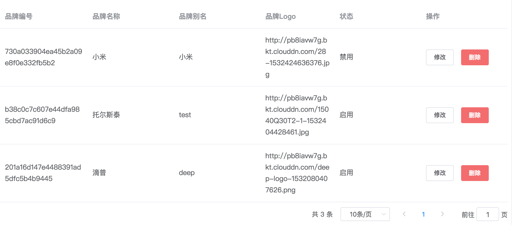
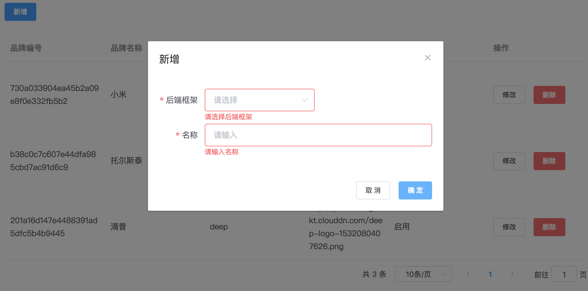
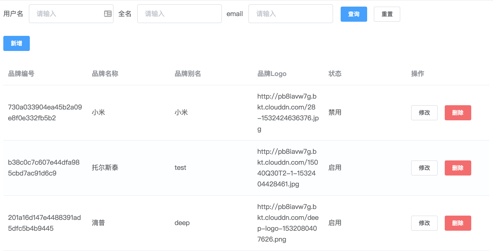
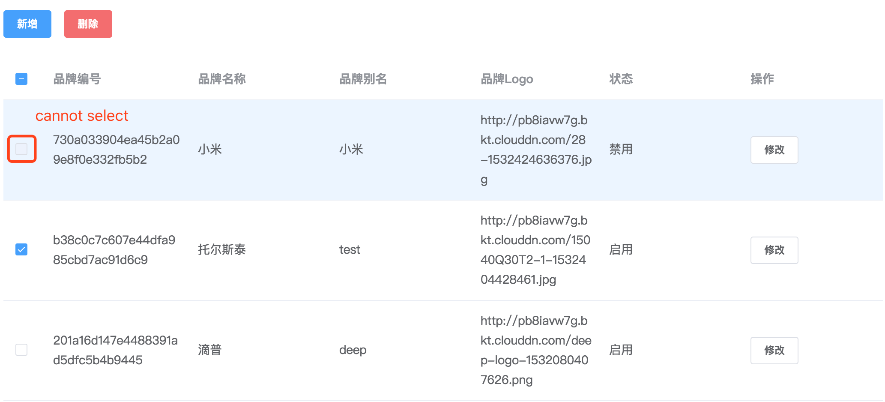
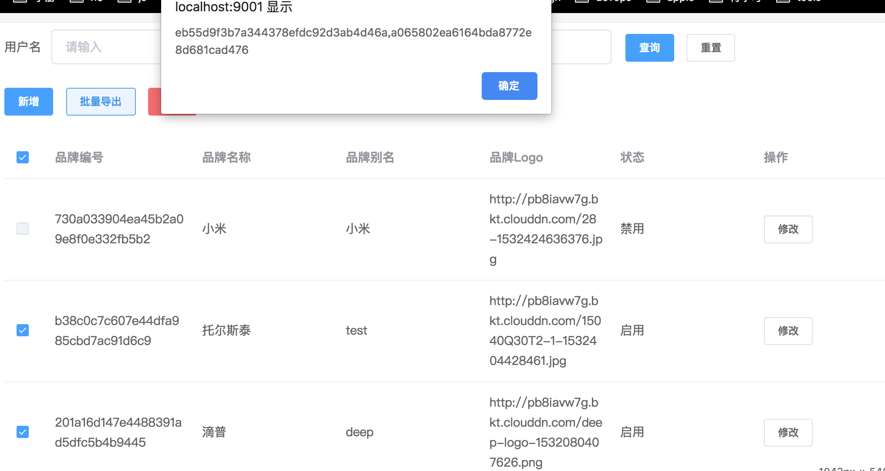

# el-data-table

[](https://www.npmjs.com/package/el-data-table)
[](https://www.npmjs.com/package/el-data-table)
[](https://github.com/FEMessage/el-data-table/blob/master/LICENSE)
[](https://github.com/FEMessage/el-data-table/pulls)

使用`axios`自动发送请求，支持树形结构，支持分页，支持自定义查询, 自定义操作列, 让 RESTful 风格的 CRUD 更简单 👏

auto requesting by `axios`, supports pagination, tree data structure, custom search, custom operation column, makes rest api easily 👏


## Table of Contents

* **[Introduction](#introduction)**
* **[Feature](#feature)**
* **[Documentation](#documentation)**
* **[Demo](#demo)**
* **[Install](#install)**
* **[Quick Start](#quick-start)**
* **[Example](#example)**
  * **[basic](#basic)**
  * **[url and columns](#url-and-columns)**
  * **[searchForm](#searchForm)**
  * **[formatter](#formatter)**
  * **[selection](#selection)**
  * **[headerButtons](#headerButtons)**
  * **[extraButtons](#extraButtons)**
  * **[beforeSearch](#beforeSearch)**
  * **[beforeConfirm](#beforeConfirm)**
  * **[customQuery](#customQuery)**
  * **[extraParams](#extraParams)**
  * **[onNew](#onNew)**
  * **[onEdit](#onEdit)**
  * **[onDelete](#onDelete)**
* **[Reference](#reference)**
* **[License](#license)**

## Introduction

### CRUD

el-data-table 就是为了解决业务问题而生的，故而封装了 CRUD 的逻辑在里面。

以用户接口示例，设其相对路径为:

```sh
/api/v1/users
```

则其 restful CRUD 接口如下：

* 查询

```sh
GET /api/v1/users?page=1&size=10
```

* 新增

```sh
POST /api/v1/users
```

* 修改(编辑)

```sh
PUT /api/v1/users/:id
```

* 删除

```sh
DELETE /api/v1/users/:id
```

则只需要使用以下代码，即可完成 CRUD 功能

```vue
<template>
  <el-data-table v-bind="tableConfig"></el-data-table>
</template>
```

```js
<script>
export default {
  data() {
    return {
      tableConfig: {
        url: '/example/users',
        columns: [
          {
            prop: 'name',
            label: '用户名'
          }
        ],
        searchForm: [
          {
            $type: 'input',
            $id: 'name',
            label: '用户名',
            $el: {
              placeholder: '请输入'
            }
          }
        ],
        form: [
          {
            $type: 'input',
            $id: 'name',
            label: '用户名',
            $el: {
              placeholder: '请输入'
            },
            rules: [
              {
                required: true,
                message: '请输入用户名',
                trigger: 'blur'
              }
            ]
          }
        ]
      }
    }
  }
}
</script>
```

效果如下：

* 查询


* 新增


* 修改


* 删除


[⬆ Back to Top](#table-of-contents)

### 数据驱动

把 template 的内容移动到 script 中, 意味着 template 可以精简，js 可以抽取出来，方便复用；同时，js 里的数据其实就是一段 json，这也让代码生成工具有了用武之地。


[⬆ Back to Top](#table-of-contents)

### WHY

为什么要在 element-ui 的 el-table 的基础上封装一个 el-data-table?

我常听到有以下几种声音：

1.  el-table 已可以覆盖大部分场景，暂无扩展需求
2.  封装了这么多东西，耦合太严重了
3.  涉及过多的业务逻辑，有点僵化，业务操作还是交给开发者去处理

首先 el-table 的确很灵活，只不过，在实现分页请求的时候，仅有 el-table 还不够，还需要组合 el-pagination 组件来实现。而分页处理的内容大多都是重复的，如果不封装，只会产生冗余的代码。

而中后台太多都是 CRUD 的操作，结合 restful API，使用得只传一个 url 让组件做 CRUD 成为了可能。

其次，很多有经验的“老手”觉得组件越灵活越好。

但对于经验尚浅的“新手”，他们并不熟悉常见的业务场景，对一些基本操作，如果表单校验，空格过滤，添加 loading，异常处理，他们只会漏掉，而这正是产生 bug 的源头。

对于一线的业务开发人员而言，面对做不完的业务，其实他们并不想去处理重复的业务逻辑，他们只想解放双手，早点下班。

正是在这样的背景下，产生了 el-data-table。

[⬆ Back to Top](#table-of-contents)

## Feature

* 只需进行 json 配置，即可实现 restful 风格的 CRUD 四个接口的对接
* 支持表格内展示树形结构数据(该功能 element-ui 官方是不支持的)
* 自带分页逻辑
* 可扩展自定义列按钮，以及自定义操作函数
* 支持分页查询后，点击详情再返回，恢复上一次的查询状态

[⬆ Back to Top](#table-of-contents)

## Documentation

* [full api doc](https://femessage.github.io/el-data-table/)
* [online demo](https://femessage.github.io/el-data-table/storybook/)

[⬆ Back to Top](#table-of-contents)

## Demo

you can run demo on your localhost, just follow these scripts

```bash
# clone the source code
git clone https://github.com/FEMessage/el-data-table.git

# enter the directory
cd el-data-table

# install the dependencies
yarn

# run demo in ./stories
yarn story
```

[⬆ Back to Top](#table-of-contents)

## pre install

this component peerDependencies on [element-ui](http://element.eleme.io/#/zh-CN/component/table) and [el-form-renderer](https://github.com/FEMessage/el-form-renderer) and [axios](https://github.com/axios/axios)

make sure you have installed in your project

```sh
yarn add element-ui @femessage/el-form-renderer axios
```

if you want to develop the component on your localhost, you should install with -P

```sh
yarn add element-ui @femessage/el-form-renderer axios -P
```

[⬆ Back to Top](#table-of-contents)

## Install

encourage using [yarn](https://yarnpkg.com/en/docs/install#mac-stable) to install

```sh
yarn add el-data-table
```

[⬆ Back to Top](#table-of-contents)

## Quick Start

### global register component

this is for minification reason: in this way building your app,

webpack or other bundler just bundle the dependencies into one vendor for all pages which using this component,

instead of one vendor for one page

```js
import Vue from 'vue'

// register component and loading directive
import ElDataTable from 'el-data-table'
import ElFormRenderer from '@femessage/el-form-renderer'
import {
  Button,
  Dialog,
  Form,
  FormItem,
  Loading,
  Pagination,
  Table,
  TableColumn,
  Message,
  MessageBox
} from 'element-ui'

Vue.use(Button)
Vue.use(Dialog)
Vue.use(Form)
Vue.use(FormItem)
Vue.use(Loading.directive)
Vue.use(Pagination)
Vue.use(Table)
Vue.use(TableColumn)
Vue.component('el-form-renderer', ElFormRenderer)
Vue.component('el-data-table', ElDataTable)

// to show confirm before delete
Vue.prototype.$confirm = MessageBox.confirm

// show tips
Vue.prototype.$message = Message

// if the table component cannot access `this.$axios`, it cannot send request
import axios from 'axios'
Vue.prototype.$axios = axios
```

### template

```vue
<template>
  <el-data-table></el-data-table>
</template>
```

[⬆ Back to Top](#table-of-contents)

## Example

### basic

suppose the api response looks like this:

```js
{
  "code": 0,
  "msg": "ok",
  "payload": {
    "content": [], // the data to render
    "totalElements": 2 // total count
  }
}
```

we get setting

```vue
<el-data-table
  dataPath="payload.content"
  totalPath="payload.totalElement"
>
</el-data-table>
```

that's the default setting, you can get your custom setting according to your api

now I'll show you more code example, here we go🚴

[⬆ Back to Top](#table-of-contents)

### url and columns

```vue
<!-- template -->
<el-data-table
  :url="url"
  :columns="columns"
>
</el-data-table>
```

```js
// script
export default {
  data() {
    return {
      url: 'https://easy-mock.com/mock/5b586c9dfce1393a862d034d/example/img',
      // full attributes of columns see: http://element.eleme.io/#/zh-CN/component/table#table-column-attributes
      columns: [
        {prop: 'code', label: '品牌编号'},
        {prop: 'name', label: '品牌名称'},
        {prop: 'alias', label: '品牌别名'},
        {
          prop: 'logoUrl',
          label: '品牌Logo',
          width: '150px'
        },
        {
          prop: 'status',
          label: '状态',
          formatter: row => (row.status === 'normal' ? '启用' : '禁用')
        }
      ]
    }
  }
}
```



> if `url` change, the table will reload

[⬆ Back to Top](#table-of-contents)

### new/edit form

this will show new or edit form, when you click new or edit button

```vue
<!-- template -->
<el-data-table
  :url="url"
  :columns="columns"
  :form="form"
>
</el-data-table>
```

```js
// script
form: [
  {
    $type: 'select',
    $id: 'backendFramework',
    label: '后端框架',
    rules: [{required: true, message: '请选择后端框架', trigger: 'blur'}],
    $options: ['DUBBO', 'HSF'].map(f => ({label: f, value: f})),
    $el: {
      placeholder: '请选择'
    }
  },
  {
    $type: 'input',
    $id: 'name',
    label: '名称',
    rules: [
      {
        required: true,
        message: '请输入名称',
        trigger: 'blur',
        transform: v => v && v.trim()
      }
    ],
    $el: {placeholder: '请输入'}
  }
]
```



[⬆ Back to Top](#table-of-contents)

### searchForm

```vue
<!-- template -->
<el-data-table
  :url="url"
  :columns="columns"
  :form="form"
  :searchForm="searchForm"
>
</el-data-table>
```

```js
// script
searchForm: [
  {
    $el: {placeholder: '请输入'},
    label: '用户名',
    $id: 'username',
    $type: 'input'
  },
  {
    $el: {placeholder: '请输入'},
    label: '全名',
    $id: 'fullname',
    $type: 'input'
  },
  {
    $el: {placeholder: '请输入'},
    label: 'email',
    $id: 'email',
    $type: 'input'
  }
]
```



[⬆ Back to Top](#table-of-contents)

### formatter

```vue
<!-- template -->
<el-data-table
  :url="url"
  :columns="columns"
>
```

```js
// script
columns: [
  // formatter: you can return the jsx syntax
  {
    prop: 'imageUrl',
    label: '商品图片',
    formatter: row => (
      <div>
        
      </div>
    )
  }
]
```


[⬆ Back to Top](#table-of-contents)

### selection

```vue
<!-- template -->
<el-data-table
  :url="url"
  :columns="columns"
>
</el-data-table>
```

```js
// script
columns: [
  // type: 'selection' will show checkbox
  // see http://element.eleme.io/#/zh-CN/component/table#table-column-attributes
  {type: 'selection', selectable: (row, index) => index > 0},
  {prop: 'code', label: '品牌编号'},
  {prop: 'name', label: '品牌名称'},
  {prop: 'alias', label: '品牌别名'},
  {
    prop: 'logoUrl',
    label: '品牌Logo',
    width: '150px'
  },
  {
    prop: 'status',
    label: '状态',
    formatter: row => (row.status === 'normal' ? '启用' : '禁用')
  }
]
```



[⬆ Back to Top](#table-of-contents)

### headerButtons

buttons on the top of the table

> attention: click function called `atClick`

```vue
<!-- template -->
<el-data-table
  :url="url"
  :columns="columns"
  :headerButtons="headerButtons"
>
</el-data-table>
```

```js
// script
// more attribute see: https://femessage.github.io/el-data-table/
headerButtons: [
  {
    text: '批量导出',
    disabled: selected => selected.length == 0,
    // selected 是选中行所组成的数组
    atClick: selected => {
      let ids = selected.map(s => s.id)
      alert(ids)
    }
  }
]
```



[⬆ Back to Top](#table-of-contents)

### extraButtons

extra buttons in operation column

> attention: click function called `atClick`

```vue
<!-- template -->
<el-data-table
  :url="url"
  :columns="columns"
  :extraButtons="extraButtons"
>
</el-data-table>
```

```js
// script
// more attribute see: https://femessage.github.io/el-data-table/
extraButtons: [
  {
    type: 'primary',
    text: '跳转',
    // row 是单行的数据
    atClick: row => {
      alert('跳转' + row.code)
      return Promise.resolve()
    }
  }
]
```


[⬆ Back to Top](#table-of-contents)

### beforeSearch

This function will invoke after clicking search button. It should return promise, if it resolve, search will execute;
if it reject, search won't execute.

```vue
<!-- template -->
<el-data-table
  :url="url"
  :columns="columns"
  :searchForm="searchForm"
  :beforeSearch="beforeSearch"
>
</el-data-table>
```

```js
// script
return {
  url: '',
  columns: [
    {prop: 'name', label: '用户名'},
    {prop: 'createdBy', label: '创建人'},
    {prop: 'userInfo.createTime', label: '创建时间'}
  ],
  searchForm: [
    {
      $type: 'input',
      $id: 'name',
      label: '用户名',
      $el: {placeholder: '请输入用户名'}
      //            rules: [{required: true, trigger: 'blur', whitespace: true}]
    }
  ],
  beforeSearch: () => {
    this.url = 'https://xxx'
    return Promise.resolve()
  }
}
```

[⬆ Back to Top](#table-of-contents)

### beforeConfirm

在新增/修改弹窗点击确认, 并完成表单 form 表单校验后调用，需要返回 Promise.
如果 resolve, 则会发送新增/修改请求; 如果 reject, 则不会发送新增/修改请求.
参数: (data, isNew) data 为表单数据, isNew true 表示是新增弹窗, false 为 编辑弹窗

```vue
<el-data-table
  :beforeConfirm="beforeConfirm"
>
</el-data-table>
```

```js
beforeConfirm(data, isNew) {
  console.log(data, isNew)

  if (isNew) {
	alert('新增可以发送请求')
	return Promise.resolve()
  } else {
	alert('修改不可以发送请求')
	return Promise.reject()
  }
}
```

[⬆ Back to Top](#table-of-contents)

### customQuery

查询时，在 url 上添加额外的参数

```js
customQuery: {
  type: 1
}
```

[⬆ Back to Top](#table-of-contents)

假设`url`参数配置为`/api/v1/users`

则实际查询请求为：`/api/v1/users?type=1`

### extraParams

新增/修改请求时，在 body 里添加额外的参数

```js
extraParams: {
  version: 0,
  isTree: false
}
```

[⬆ Back to Top](#table-of-contents)

### onNew

默认情况下, 新增的请求格式是 POST url body
当默认新增方法不满足需求时可使用 onNew, 需要返回 promise
参数(data, row) data 是 form 表单的数据, row 是当前行的数据, 只有 isTree 为 true 时, 点击操作列的新增按钮才会有值

```vue
<el-data-table
  :onNew="onNew"
>
</el-data-table>
```

```js
import Axios from 'axios'

onNew(data, row) {
  console.log(data, row)
  return Axios.post(
	'https://www.easy-mock.com/mock/5bbefdf6faedce31cd6a5261/example/on-new',
	data
  )
},
```

[⬆ Back to Top](#table-of-contents)

### onEdit

默认情况下, 修改的请求格式是 PUT url/id body
点击修改按钮时的方法, 当默认修改方法不满足需求时可使用 onEdit, 需要返回 promise
参数(data, row) data 是 form 表单的数据, row 是当前行的数据

```vue
<el-data-table
  :onEdit="onEdit"
>
</el-data-table>
```

```js
import Axios from 'axios'

onEdit(data, row) {
  console.log(data, row)
  return Axios.put(
	'https://www.easy-mock.com/mock/5bbefdf6faedce31cd6a5261/example/on-edit',
	data
  )
}
```

[⬆ Back to Top](#table-of-contents)

### onDelete

默认情况下:

* 删除单个的请求格式是 DELETE url/id
* 删除多个的请求格式是 DELETE url/id,id,id

当不满足需求时, 可以使用 onDelete, 自定义删除方法, 返回 promise

```vue
<el-data-table
  onDelete="onDelete"
>
</el-data-table>
```

```js
import Axios from 'axios'

// 多选时, 参数为selected, 代表选中的行组成的数组
onDelete: selected => {
  return Axios.delete(
    'https://www.easy-mock.com/mock/5bbefdf6faedce31cd6a5261/example/on-delete',
    {
      data: selected.map(v => v.id)
    }
  )
}

// 非多选时参数为row, 代表单行的数据
onDelete: row => {
  return Axios.delete(
    'https://www.easy-mock.com/mock/5bbefdf6faedce31cd6a5261/example/on-delete',
    {
      data: {
        id: row.id
      }
    }
  )
}
```

[⬆ Back to Top](#table-of-contents)

## Reference

* [form rules detail see async-validator](https://github.com/yiminghe/async-validator)
* [el-input enter to submit](https://github.com/ElemeFE/element/pull/5920)
* [html spec form submission](https://www.w3.org/MarkUp/html-spec/html-spec_8.html#SEC8.2)
* [What_is_a_URL](https://developer.mozilla.org/zh-CN/docs/Learn/Common_questions/What_is_a_URL)
* [History_API](https://developer.mozilla.org/en-US/docs/Web/API/History_API)
* [encodeURIComponent](https://developer.mozilla.org/en-US/docs/Web/JavaScript/Reference/Global_Objects/encodeURIComponent)
* [RegExp](https://developer.mozilla.org/zh-CN/docs/Web/JavaScript/Reference/Global_Objects/RegExp)
* [从 vue-router 看前端路由的两种实现](https://zhuanlan.zhihu.com/p/27588422)
* [peer-dependencies](https://nodejs.org/en/blog/npm/peer-dependencies/)

[⬆ Back to Top](#table-of-contents)

## License

[MIT](./LICENSE)

[⬆ Back to Top](#table-of-contents)
