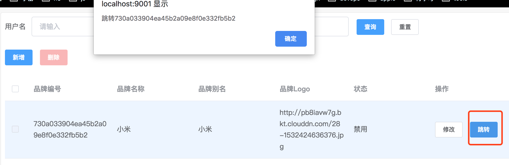

# el-data-table

使用`axios`自动发送请求，支持树形结构，支持分页，支持自定义查询, 自定义操作列, 让 RESTful 风格的 CRUD 更简单 👏

auto requesting by `axios`, supports pagination, tree data structure, custom search, custom operation column, makes rest api easily 👏

## feature

* 只需进行简单的配置，即可实现 RESTful 风格的 CRUD 四个接口的对接
* 自带新增/修改/删除逻辑(默认新增/修改都是弹窗表单形式)
* 支持表格内展示树形结构数据(该功能 element-ui 官方是不支持的)
* 封装了拼接 query 查询逻辑，只需配置 json 即可进行 GET 请求查询
* 可扩展自定义列按钮
* 自带分页逻辑
* 支持查询参数持久化，适配`hash`, `history`两种路由模式

## documentation

* [full api doc](https://femessage.github.io/el-data-table/)
* [online demo](https://femessage.github.io/el-data-table/storybook/)

## pre install

this component peerDependencies on [element-ui](http://element.eleme.io/#/zh-CN/component/table) and [el-form-renderer](https://github.com/leezng/el-form-renderer) and [axios](https://github.com/axios/axios)

make sure you have installed

```sh
yarn add element-ui el-form-renderer axios
```

## install

encourage using [yarn](https://yarnpkg.com/en/docs/install#mac-stable) to install

```sh
yarn add el-data-table
```

## usage

### global register component

this is for minification reason: in this way building your app,

webpack or other bundler just bundle the dependencies into one vendor for all pages which using this component,

instead of one vendor for one page

```js
import Vue from 'vue'

// register component and loading directive
import ElDataTable from 'el-data-table'
import ElFormRenderer from 'el-form-renderer'
import {
  Button,
  Dialog,
  Form,
  FormItem,
  Loading,
  Pagination,
  Table,
  TableColumn,
  MessageBox
} from 'element-ui'

Vue.use(ElDataTable)
Vue.use(Button)
Vue.use(Dialog)
Vue.use(Form)
Vue.use(FormItem)
Vue.use(Loading.directive)
Vue.use(Pagination)
Vue.use(Table)
Vue.use(TableColumn)
Vue.component('el-form-renderer', ElFormRenderer)

// to show confirm before delete
Vue.prototype.$confirm = MessageBox.confirm
// if the table component cannot access `this.$axios`, it cannot send request
import axios from 'axios'
Vue.prototype.$axios = axios
```

### template

```vue
<template>
  <el-data-table></el-data-table>
</template>
```

## example

### basic

suppose the api response looks like this:

```js
{
  "code": 0,
  "msg": "ok",
  "payload": {
    "content": [], // the data to render
    "totalElements": 2 // total count
  }
}
```

we get setting

```vue
<el-data-table
  dataPath="payload.content"
  totalPath="payload.totalElement"
>
</el-data-table>
```

that's the default setting, you can get your custom setting according to your api

now I'll show you more code example, here we go🚴

### url and columns

```vue
<!-- template -->
<el-data-table
  :url="url"
  :columns="columns"
>
</el-data-table>
```

```js
// script
export default {
  data() {
    return {
      url: 'https://easy-mock.com/mock/5b586c9dfce1393a862d034d/example/img',
      // full attributes of columns see: http://element.eleme.io/#/zh-CN/component/table#table-column-attributes
      columns: [
        {prop: 'code', label: '品牌编号'},
        {prop: 'name', label: '品牌名称'},
        {prop: 'alias', label: '品牌别名'},
        {
          prop: 'logoUrl',
          label: '品牌Logo',
          width: '150px'
        },
        {
          prop: 'status',
          label: '状态',
          formatter: row => (row.status === 'normal' ? '启用' : '禁用')
        }
      ]
    }
  }
}
```


### new/edit form

this will show new or edit form, when you click new or edit button

```vue
<!-- template -->
<el-data-table
  :url="url"
  :columns="columns"
  :form="form"
>
</el-data-table>
```

```js
// script
form: [
  {
    $type: 'select',
    $id: 'backendFramework',
    label: '后端框架',
    rules: [{required: true, message: '请选择后端框架', trigger: 'blur'}],
    $options: ['DUBBO', 'HSF'].map(f => ({label: f, value: f})),
    $el: {
      placeholder: '请选择'
    }
  },
  {
    $type: 'input',
    $id: 'name',
    label: '名称',
    rules: [
      {
        required: true,
        message: '请输入名称',
        trigger: 'blur',
        transform: v => v && v.trim()
      }
    ],
    $el: {placeholder: '请输入'}
  }
]
```


### searchForm

```vue
<!-- template -->
<el-data-table
  :url="url"
  :columns="columns"
  :form="form"
  :searchForm="searchForm"
>
</el-data-table>
```

```js
// script
searchForm: [
  {
    $el: {placeholder: '请输入'},
    label: '用户名',
    $id: 'username',
    $type: 'input'
  },
  {
    $el: {placeholder: '请输入'},
    label: '全名',
    $id: 'fullname',
    $type: 'input'
  },
  {
    $el: {placeholder: '请输入'},
    label: 'email',
    $id: 'email',
    $type: 'input'
  }
]
```


### beforeSearch

This function will invoke after clicking search button. It should return promise, if it resolve, search will execute;
if it reject, search won't execute.

```vue
<!-- template -->
<el-data-table
  :url="url"
  :columns="columns"
  :searchForm="searchForm"
  :beforeSearch="beforeSearch"
>
</el-data-table>
```

```js
// script
data() {
return {
  url: '',
  columns: [
	{prop: 'name', label: '用户名'},
	{prop: 'createdBy', label: '创建人'},
	{prop: 'userInfo.createTime', label: '创建时间'}
  ],
  searchForm: [
	{
	  $type: 'input',
	  $id: 'name',
	  label: '用户名',
	  $el: {placeholder: '请输入用户名'}
	  //            rules: [{required: true, trigger: 'blur', whitespace: true}]
	}
  ],
  beforeSearch: () => {
	this.url = 'https://xxx'
	return Promise.resolve()
  }
}
}
```

### selection

```vue
<!-- template -->
<el-data-table
  :url="url"
  :columns="columns"
>
</el-data-table>
```

```js
// script
columns: [
  // type: 'selection' will show checkbox
  // see http://element.eleme.io/#/zh-CN/component/table#table-column-attributes
  {type: 'selection', selectable: (row, index) => index > 0},
  {prop: 'code', label: '品牌编号'},
  {prop: 'name', label: '品牌名称'},
  {prop: 'alias', label: '品牌别名'},
  {
    prop: 'logoUrl',
    label: '品牌Logo',
    width: '150px'
  },
  {
    prop: 'status',
    label: '状态',
    formatter: row => (row.status === 'normal' ? '启用' : '禁用')
  }
]
```


### headerButtons

buttons on the top of the table

> attention: click function called `atClick`

```vue
<!-- template -->
<el-data-table
  :url="url"
  :columns="columns"
  :headerButtons="headerButtons"
>
</el-data-table>
```

```js
// script
// more attribute see: https://femessage.github.io/el-data-table/
headerButtons: [
  {
    text: '批量导出',
    disabled: selected => selected.length == 0,
    atClick: selected => {
      let ids = selected.map(s => s.id)
      alert(ids)
    }
  }
]
```


### extraButtons

extra buttons in operation column

> attention: click function called `atClick`

```vue
<!-- template -->
<el-data-table
  :url="url"
  :columns="columns"
  :extraButtons="extraButtons"
>
</el-data-table>
```

```js
// script
// more attribute see: https://femessage.github.io/el-data-table/
extraButtons: [
  {
    type: 'primary',
    text: '跳转',
    atClick: row => alert('跳转' + row.code)
  }
]
```



### extraParams on new/edit

```js
extraParams: {
  version: 0,
  isTree: false
}
```

### customQuery on search

```js
customQuery: {
  type: this.$route.query.type
}
```

### `onNew`/`onEdit`

如果默认的新增、编辑弹窗不能满足需求,可以使用`onNew`/`onEdit`方法

点击新增/编辑按钮, 会触发`onNew`/`onEdit`方法

适用场景：想使用 el-data-table 默认的新编、编辑按钮，并需要自定义点击行为的情况

例子: 点击新增/编辑按钮，跳转到详情页面

```vue
<template>
  <el-data-table
    onNew="onNew"
    onEdit="onEdit"
  >
  </el-data-table>
</template>
<script>
export default {
  data() {
    return {}
  },
  methods: {
    onNew() {
      this.$router.push({
        path: detailPage
      })
    },
    onEdit(row) {
      this.$router.push({
        path: detailPage,
        query: {id: row.id}
      })
    }
  }
}
</script>
```

### 监听 `new` /`edit` 事件

如果想在默认的新增、编辑方法中增加额外的操作。可以监听 `new` 、`edit` 事件

点击新增/修改按钮，会触发`new`/`edit`事件

适用场景: 想利用 el-data-table 快速渲染弹窗表单的特性，并且复用默认的`new`/`edit`的逻辑，但弹窗含有自定义组件, 无法通过配置进行渲染的情况

例子：在新增和编辑的弹窗中，除了常规的表单元素，还要增加一个上传图片组件，并且发送`POST`/`PUT`请求的 body 中，带上图片的 url

```vue
<template>
  <el-data-table
    :extraParams=extraParams
    @new="clearExtraParams"
    @edit="setExtraParams"
  >
    <div slot="form" prop="logo">
      <div class="form-label"> 品牌logo</div>
      <my-upload-component
        :onLoadSuccess="onLoadSuccess"
        :fileUrl="extraParams.logoUrl">
      </my-upload-component>
    </div>
  </el-data-table>
</template>
<script>
export default {
  data() {
    return {
      extraParams: {
        logoUrl: ''
      }
    }
  },
  methods: {
    onLoadSuccess(url) {
      this.extraParams.logoUrl = url // 将成功后的url 放进extraParams
    },
    clearExtraParams() {
      this.extraParams.logoUrl = '' //清空extraParams
    },
    setExtraParams(row) {
      this.extraParams.logoUrl = row.logoUrl //将原有的logoUrl 放入extraParams
    }
  }
}
</script>
```

技巧点：

1.  上传成功后把图片 url 放在 `extraParams` 上
2.  点击新增按钮时，清除 `extraParams.logoUrl`
3.  点击编辑按钮时，设置`extraParams.logoUrl`

## refer

* [form rules detail see async-validator](https://github.com/yiminghe/async-validator)
* [el-input enter to submit](https://github.com/ElemeFE/element/pull/5920)
* [html spec form submission](https://www.w3.org/MarkUp/html-spec/html-spec_8.html#SEC8.2)
* [What_is_a_URL](https://developer.mozilla.org/zh-CN/docs/Learn/Common_questions/What_is_a_URL)
* [History_API](https://developer.mozilla.org/en-US/docs/Web/API/History_API)
* [encodeURIComponent](https://developer.mozilla.org/en-US/docs/Web/JavaScript/Reference/Global_Objects/encodeURIComponent)
* [RegExp](https://developer.mozilla.org/zh-CN/docs/Web/JavaScript/Reference/Global_Objects/RegExp)
* [从 vue-router 看前端路由的两种实现](https://zhuanlan.zhihu.com/p/27588422)
* [peer-dependencies](https://nodejs.org/en/blog/npm/peer-dependencies/)
